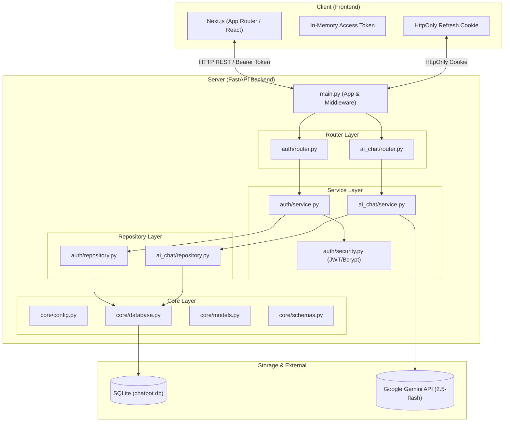
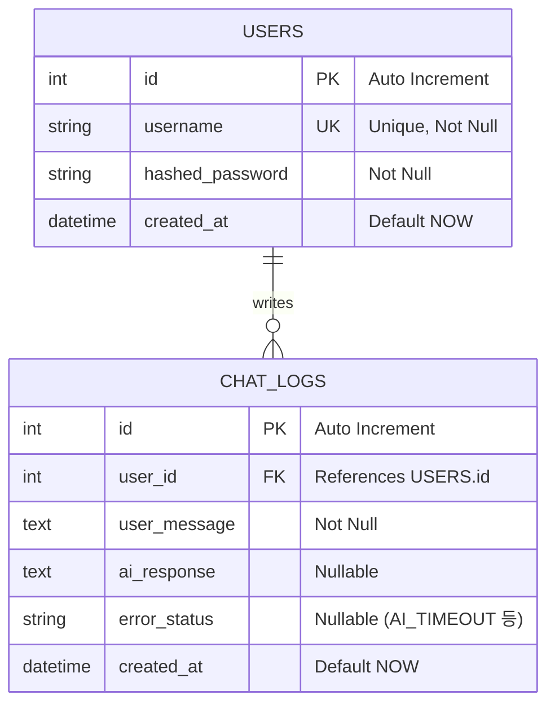

# Codyssey AI Chatbot

## 1. 프로젝트 개요
*   **문제 정의**: 사용자가 편리하게 AI와 대화하고 과거 대화 이력을 확인할 수 있는 안정적인 웹 기반 챗봇 서비스 필요
*   **타겟 사용자**: AI의 도움을 받아 정보를 얻거나 작업을 수행하고자 하는 일반 사용자
*   **핵심 시나리오**:
    1. 사용자가 계정을 생성하고 로그인한다.
    2. 챗봇 화면에서 질문을 입력하면, AI가 맥락을 이해하고 응답을 반환한다.
    3. 과거의 대화 기록이 자동으로 저장되어 재로그인 시에도 확인 가능하다.
    4. AI 서버 지연 시 사용자에게 친절한 안내 메시지를 제공한다.
*   **비로그인 제한의 보안적·정책적 근거**:
    *   **개인정보 및 대화 프라이버시 보호**: 사용자별 대화 로그를 엄격히 분리·보호하기 위해 인증된 사용자만 대화 세션에 접근하도록 제한합니다.
    *   **AI API 자원 고갈 및 어뷰징 방지**: 무분별한 비인가 요청으로 인한 외부 LLM API(Gemini) 호출 비용 폭증 및 서비스 거부(DoS) 공격을 사전에 차단합니다.

## 2. 시스템 구조
*   **아키텍처**: 프론트엔드/백엔드 분리형 아키텍처 (Next.js + FastAPI + SQLite)
*   **주요 컴포넌트 역할**:
    *   **Frontend (Next.js)**: 사용자 인터페이스 제공 및 비동기 API 통신(Fetch API).
    *   **Backend (FastAPI)**: REST API 서버. 사용자 인증(JWT), 입력 검증, 비즈니스 로직(AI 호출, 에러 핸들링) 처리.
    *   **Database (SQLite + SQLAlchemy)**: 사용자 정보 및 채팅 로그(질문, 응답, 에러 상태, 시간) 영구 저장.
    *   **AI Service (Gemini API)**: `google-generativeai` 라이브러리를 사용해 프롬프트 및 컨텍스트를 기반으로 답변 생성.

### 아키텍처 다이어그램 (Mermaid)



### 파일 수준 구성요소 역할 및 디렉토리 책임 범위

| 모듈 / 디렉토리 | 파일 경로 | 주요 역할 및 책임 범위 | 담당 엔드포인트 |
|---|---|---|---|
| **Entrypoint** | `main.py` | FastAPI 앱 인스턴스 생성, CORS 미들웨어 등록, 라우터 통합, DB 테이블 자동 생성 | `GET /` |
| **Core** | `core/config.py` | Pydantic `BaseSettings` 기반 환경변수(`.env`) 중앙 관리 및 검증 | - |
| | `core/database.py` | SQLAlchemy 엔진 생성, 세션 팩토리(`SessionLocal`) 및 `get_db` 의존성 제공 | - |
| | `core/models.py` | 데이터베이스 ORM 테이블 모델 정의 (`User`, `ChatLog`) | - |
| | `core/schemas.py` | Pydantic v2 데이터 검증 모델 (`UserCreate`, `Token`, `ChatRequest`, `ChatResponse`) | - |
| **Auth** | `auth/router.py` | 인증 HTTP 엔드포인트 라우팅 및 쿠키 세팅 | `POST /api/auth/signup`<br>`POST /api/auth/login`<br>`POST /api/auth/refresh`<br>`POST /api/auth/logout` |
| | `auth/service.py` | 회원가입 중복 검사, 패스워드 해싱, JWT 토큰 발급/검증 비즈니스 로직 | - |
| | `auth/repository.py` | User 테이블 CRUD 쿼리 추상화 (`get_user_by_username`, `create_user`) | - |
| | `auth/security.py` | bcrypt 비밀번호 해싱/검증, JWT 발급, `get_current_user` 인증 의존성 | - |
| | `auth/validators.py` | 아이디(3~50자, 영문/숫자) 및 비밀번호(8자 이상, 영문+숫자) 검증 로직 | - |
| **AI Chat** | `ai_chat/router.py` | 채팅 HTTP 요청 수신, 의존성 주입(`get_current_user`, `get_db`), Service 위임 | `POST /api/chat`<br>`GET /api/me/chats` |
| | `ai_chat/service.py` | 대화 맥락(최근 3턴) 조립, 비동기 AI 통신(`asyncio.to_thread`), 타임아웃 및 대체 응답 처리 | - |
| | `ai_chat/repository.py` | 질문 선저장(1차), 응답/에러 후저장(2차), 대화 내역 조회 CRUD 전담 | - |

### 3계층 아키텍처 (Router - Service - Repository) 원칙
1. **Router 계층**: HTTP 요청 수신, 파라미터 유효성 검사, 의존성 주입(`Depends`), HTTP 상태 코드 및 응답 변환만 담당합니다.
2. **Service 계층**: 비즈니스 흐름 제어, AI 통신, 비밀번호 암호화 등 핵심 도메인 로직을 수행합니다.
3. **Repository 계층**: SQLAlchemy 세션을 주입받아 순수 데이터베이스 쿼리와 트랜잭션(`add`, `commit`, `refresh`)만을 전담하여 데이터 접근을 추상화합니다.

## 3. API 명세

### 3.1 엔드포인트 접근 권한 요약

| 엔드포인트 | 메서드 | 접근 권한 | 설명 |
|---|---|---|---|
| `/api/auth/signup` (`/register`) | `POST` | **공개 (Public)** | 신규 회원가입 |
| `/api/auth/login` | `POST` | **공개 (Public)** | 로그인 및 JWT 토큰/쿠키 발급 |
| `/api/auth/refresh` | `POST` | **공개 (쿠키 검증)** | Refresh Token 쿠키를 통한 토큰 재발급 |
| `/api/auth/logout` | `POST` | **공개 (쿠키 만료)** | 로그아웃 및 세션 쿠키 제거 |
| `/api/chat` | `POST` | **인증 필요 (Bearer JWT)** | AI 질문 전송 및 답변 생성 |
| `/api/me/chats` | `GET` | **인증 필요 (Bearer JWT)** | 현재 로그인된 사용자의 전체 대화 기록 조회 |

### 3.2 인증 API
*   `POST /api/auth/signup` (또는 `/register`): 회원가입
    *   요청: `{"username": "user1", "password": "password123"}`
    *   성공 응답 (`201 Created`): `{"id": 1, "username": "user1", "created_at": "..."}`
    *   실패 응답 - 아이디 중복 (`409 Conflict`):
        ```json
        {
          "detail": "Username already registered"
        }
        ```
    *   실패 응답 - 유효성 검사 실패 (`422 Unprocessable Entity`):
        ```json
        {
          "detail": "비밀번호는 최소 8자 이상이어야 합니다."
        }
        ```
*   `POST /api/auth/login`: 로그인 (JWT 발급)
    *   요청 (JSON): `{"username": "user1", "password": "password123"}` (Content-Type: application/json)
    *   성공 응답 (`200 OK`):
        ```json
        {
          "access_token": "eyJhbGciOiJIUzI1NiIsInR5cCI6IkpXVCJ9...",
          "refresh_token": "eyJhbGciOiJIUzI1NiIsInR5cCI6IkpXVCJ9...",
          "token_type": "bearer"
        }
        ```
    *   실패 응답 - 비밀번호/아이디 불일치 (`401 Unauthorized`):
        ```json
        {
          "detail": "Incorrect username or password"
        }
        ```

### 3.3 챗봇 API
*   `POST /api/chat`: AI 질문 전송 (Requires Bearer Token)
    *   요청: `{"message": "안녕, 넌 누구니?"}`
    *   성공 응답 (`200 OK`): `{"id": 1, "user_message": "안녕, 넌 누구니?", "ai_response": "저는 AI 어시스턴트입니다.", "error_status": null, "created_at": "..."}`
    *   AI 지연/오류 시 대체 응답 (`200 OK`):
        ```json
        {
          "id": 2,
          "user_message": "안녕, 넌 누구니?",
          "ai_response": "현재 응답이 지연되고 있어요. 잠시 후 다시 시도해 주세요. (error: AI_TIMEOUT)",
          "error_status": "AI_TIMEOUT",
          "created_at": "..."
        }
        ```
*   `GET /api/me/chats`: 내 대화 내역 조회 (Requires Bearer Token)
    *   응답: `[{"id": 1, "user_message": "...", "ai_response": "...", ...}]`

### 3.4 비로그인 공통 인증 실패 응답 (`401 Unauthorized`)
인증 헤더(`Authorization: Bearer <token>`)가 없거나 토큰이 유효하지 않은 상태로 보호된 엔드포인트(`/api/chat`, `/api/me/chats`)를 호출할 경우 일관되게 `401` 상태 코드와 한글 안내 메시지를 반환합니다:
```json
{
  "detail": "로그인이 필요합니다."
}
```

### 3.5 입력값 검증 규칙 및 스키마 관리 정책
*   **입력 검증 규칙 (Pydantic & 프론트엔드 동일 적용)**:
    *   `username`: 3~50자, 영문자/숫자/언더스코어(`_`)만 허용.
    *   `password`: 최소 8자 이상, 영문자와 숫자 각각 1개 이상 필수 포함.
    *   `message`: 1자 이상 1,000자 이하 (`min_length=1, max_length=1000`).
*   **스키마 버전 및 호환성 관리 정책**:
    *   하위 호환성(Backward Compatibility) 유지를 위해 기존 필드는 임의로 삭제하거나 이름을 변경하지 않습니다.
    *   새로운 필드 추가 시 `Optional` 타입과 기본값(`None`)을 지정하여 기존 클라이언트가 중단 없이 동작하도록 보장합니다.
    *   RESTful 설계 원칙에 따라 명사형 리소스 경로(`/api/chat`, `/api/me/chats`)를 표준화하여 사용합니다.

## 4. DB 구조 (ERD / 테이블)

### 4.1 ERD 다이어그램 (Mermaid)



### 4.2 테이블 스키마 상세

**Users 테이블 (`users`)**
| 필드명 | 타입 | 설명 | 제약조건 |
|---|---|---|---|
| id | Integer | PK | Auto Increment |
| username | String(50) | 사용자 ID | Unique, Not Null |
| hashed_password | String | 암호화된 비밀번호 | Not Null |
| created_at | DateTime | 가입 일시 | 자동 생성 |

**ChatLogs 테이블 (`chat_logs`)**
| 필드명 | 타입 | 설명 | 제약조건 |
|---|---|---|---|
| id | Integer | PK | Auto Increment |
| user_id | Integer | 작성자 ID | FK (users.id), Not Null |
| user_message | Text | 사용자 질문 | Not Null |
| ai_response | Text | AI 응답 내용 | Nullable |
| error_status | String | 에러 상태 코드 | Nullable (예: "AI_TIMEOUT") |
| created_at | DateTime | 채팅 일시 | 자동 생성 |

### 4.3 스키마 마이그레이션 정책
*   **초기 테이블 생성**: 애플리케이션 시작 시 `main.py`의 `Base.metadata.create_all(bind=engine)`을 통해 정의된 모든 테이블이 자동으로 생성됩니다.
*   **운영 스키마 마이그레이션 절차 (Alembic 도입 표준)**:
    1. 마이그레이션 환경 초기화: `alembic init migrations`
    2. 모델 변경 사항 자동 감지 및 리비전 생성: `alembic revision --autogenerate -m "add_columns_to_chat_logs"`
    3. 데이터베이스에 변경 사항 적용: `alembic upgrade head`

## 5. 배포 / 실행 방법

### 요구사항
*   Python 3.9+
*   Node.js 20.9+
*   Gemini API Key

### 로컬 실행 방법
이 프로젝트는 백엔드(FastAPI)와 프론트엔드(Next.js)가 분리되어 있으므로 **두 개의 터미널**에서 각각 실행해야 합니다.

**[터미널 1: 백엔드 실행]**
프로젝트 최상단 폴더에서 실행합니다.
```bash
# 1. 가상환경 생성 및 활성화
python -m venv venv
source venv/bin/activate  # Windows: .\venv\Scripts\activate

# 2. 의존성 설치
pip install -r requirements.txt

# 3. 환경 변수 세팅
# 루트 폴더에 .env.example을 복사하여 .env 파일을 생성하고 GEMINI_API_KEY 등을 입력합니다.
cp .env.example .env
nano .env

# 4. FastAPI 서버 실행 (포트 8000)
uvicorn main:app --reload --host 0.0.0.0 --port 8000
```

**[터미널 2: 프론트엔드 실행]**
Node.js 20.9 이상이 필요합니다. `frontend` 폴더로 이동하여 실행합니다.
```bash
# 1. 프론트엔드 디렉토리 이동
cd frontend

# 2. NPM 패키지 설치
npm install

# 3. 환경 변수 설정
cp .env.example .env.local

# 4. Next.js 서버 실행 (포트 3000)
npm run dev
```
**접속:** 브라우저에서 `http://localhost:3000` 또는 `http://localhost:8000` 접속 시 전체 애플리케이션을 사용할 수 있습니다.

### AWS 실행 방법 (Ubuntu EC2 기준)
한 대의 EC2 서버에서 백엔드와 프론트엔드를 모두 띄우는 가이드입니다. Node.js 20.9 이상 버전을 사용합니다.
```bash
# 접속 방법
ssh -i "다운받은키페어이름.pem" ubuntu@복사한퍼블릭IP
# 예시
ssh -i "codyssey_keypair.pem" ubuntu@13.124.238.238

# 1. 시스템 업데이트 및 필요 패키지(Node.js 포함) 설치
sudo apt update
sudo apt install python3-pip python3-venv git curl -y
curl -fsSL https://deb.nodesource.com/setup_20.x | sudo -E bash -
sudo apt install -y nodejs

# 2. 프로젝트 클론 및 폴더 이동
git clone [본인의 깃허브 레포지토리 주소]
cd B7-1_project_codyssey

# 3. 백엔드 세팅 및 실행
python3 -m venv venv
source venv/bin/activate
pip install -r requirements.txt
cp .env.example .env
nano .env  # 백엔드 환경변수(.env) 세팅
# EC2 배포 시 필수 설정 항목:
# GEMINI_API_KEY="본인의_API_키"
# GEMINI_MODEL="gemini-3.5-flash"  (기본값: gemini-3.5-flash, 키 권한에 맞게 설정)
# SECRET_KEY="안전한_JWT_시크릿키"
# CORS_ORIGINS="http://[EC2퍼블릭IP]:3000"  (프론트엔드 브라우저 CORS 허용)
# FRONTEND_URL="http://[EC2퍼블릭IP]:3000"  (루트 접속 시 프론트 리다이렉트)
nohup uvicorn main:app --host 0.0.0.0 --port 8000 &

# 4. 프론트엔드 세팅 및 실행
cd frontend
npm install
cp .env.example .env.local
nano .env.local 
# EC2 배포 시 필수 설정 항목 (브라우저가 EC2 백엔드로 요청을 보내도록 설정):
# NEXT_PUBLIC_API_BASE_URL=http://[EC2퍼블릭IP]:8000/api
# NEXT_PUBLIC_SITE_URL=http://[EC2퍼블릭IP]:3000
npm run build
nohup npm start &

# 브라우저에서 http://[EC2퍼블릭IP]:3000 접속
```

## 6. 핵심 설계 원칙 및 운영 정책

### 6.1 세션 기반 vs JWT 토큰 기반 인증 선택 근거
*   **선택 방식**: **JWT 토큰 기반 인증** (In-Memory Access Token + HttpOnly Refresh Cookie)
*   **선택 근거**:
    1.  **무상태성(Stateless)과 수평 확장성**: Next.js 프론트엔드와 FastAPI 백엔드가 분리된 MSA형 구조에서, 백엔드 서버 인스턴스가 늘어나더라도 별도의 중앙 세션 스토리지(Redis 등) 클러스터링 비용 없이 안정적으로 토큰을 검증할 수 있습니다.
    2.  **보안 극대화 (XSS 및 CSRF 방어)**:
        *   탈취 위험이 높은 브라우저 로컬 저장소(`localStorage`) 대신 **자바스크립트 탭 메모리 변수**에만 Access Token을 유지하여 XSS(Cross-Site Scripting) 공격을 원천 차단합니다.
        *   Refresh Token은 자바스크립트 코드가 접근할 수 없는 **`HttpOnly`, `SameSite=Lax` 쿠키**로 발행하여 CSRF 공격 및 토큰 탈취를 방지합니다.
    3.  **FastAPI Depends 의존성 재사용**: `get_current_user` 의존성을 통해 모든 보호된 엔드포인트에서 일관된 토큰 검증 및 유저 주입을 수행합니다.

### 6.2 AI 보안 원칙
*   Google Gemini API Key는 클라이언트 코드(HTML/JS)에 일절 노출되지 않으며, 서버의 `.env` 환경변수와 `core/config.py`에서만 안전하게 관리됩니다. 모든 외부 LLM 호출은 백엔드 Service 계층에서 대리 수행합니다.

### 6.3 AI 타임아웃 및 재시도·대체 응답 정책 (Retry Policy)
*   **타임아웃 설정**: `asyncio.wait_for(..., timeout=settings.ai_timeout_seconds)`를 적용하여 20초 이내에 응답이 도착하지 않을 경우 즉시 코루틴을 취소하고 `AI_TIMEOUT` 예외를 발생시킵니다.
*   **재시도 전략 (Retry Strategy)**:
    *   **서버 레벨 (0회 재시도)**: AI 응답 지연 시 서버에서 백엔드 스레드를 점유하며 무리하게 자동 재시도하면 전체 사용자 대기 시간이 급증하므로, 서버에서는 추가 재시도 없이 즉시 대체 응답을 반환합니다.
    *   **클라이언트 레벨 (수동 재시도)**: 프론트엔드 UI에서 `error_status`를 감지하여 사용자에게 실패 상태를 알리고, 원문 질문을 보존하여 사용자가 원하는 시점에 1회 클릭으로 재시도할 수 있도록 지원합니다.
*   **대체 응답 정책 (Fallback Response)**:
    *   타임아웃 시: `"현재 응답이 지연되고 있어요. 잠시 후 다시 시도해 주세요. (error: AI_TIMEOUT)"`
    *   기타 서버 에러 시: `"AI 서버 처리 중 오류가 발생했습니다. 잠시 후 다시 시도해 주세요."`
    *   사용자 질문은 AI 호출 전 **1차 DB 저장(Commit)**되므로, 외부 AI 서버 오류 시에도 사용자 질문 데이터는 영구 보존됩니다.

### 6.4 운영 로그 수집 및 모니터링
*   **로그 수집 목적 및 활용**:
    1.  **멀티 유저 요청 추적 (Traceability)**: 고유 난수 `request_id`와 `user_id`를 함께 기록하여 동시 접속 환경에서도 각 요청의 생명주기를 명확히 추적합니다.
    2.  **성능 모니터링 (Latency)**: API 호출 전후 시간을 측정하여 밀리초 단위 `latency_ms`를 로깅함으로써 응답 지연 구간을 파악합니다.
    3.  **장애 감지 및 서비스 개선**: `AI_TIMEOUT`, `AI_ERROR` 등의 에러 코드를 분석하여 타임아웃 임계치 조정 및 프롬프트 튜닝에 활용합니다.
*   **데이터베이스 대화 로그 검증**:
    ```bash
    sqlite3 chatbot.db < scripts/check_logs.sql
    ```

## 7. 팀 구성원 역할 및 개인별 작업 요약 (커밋 시나리오)
이 프로젝트는 총 4명의 팀원이 협업하여 완성하였으며, 기능 단위의 브랜치 전략(`feature/*`, `refactor/*`)을 활용하여 개발을 진행했습니다. 실제 GitHub 커밋 로그에 기반한 팀원별 **전체 작업 내역**은 다음과 같습니다.

### 👩‍💻 팀원 1: 초기 설정, 코어(Core) 모듈 및 DB 연동
**주요 브랜치**: `feature/set-up`, `feature/core`, `refactor/separate-schemas-by-domain`
**역할**: 프로젝트 뼈대 구성, 데이터베이스 모델링 및 Pydantic 데이터 검증 스키마 설계, TDD(테스트 주도 개발) 도입.
**작업 내역 (Commit Summary)**:
1. `chore: initial folder setting` (45001f1)
2. `chore: add .gitignore` (8001145)
3. `chore: initial docs files` (027150b)
4. `docs: add contributing guide (rule.md)` (197d5cb)
5. `chore: FastAPI 프로젝트 기본 뼈대 구성` (c3bf376)
6. `chore: 프로젝트 core 및 tests 초기 구조 세팅` (4c5b5a8)
7. `test: core/config.py 설정 관리를 위한 테스트 작성` (c6ebab3)
8. `feat: 공통 설정 관리를 위한 core/config.py 세팅` (83324af)
9. `test: DB 연결 및 세션 관리를 위한 테스트 작성` (fd32812)
10. `feat: DB 연결 및 세션 관리를 위한 core/database.py 생성` (31cd047)
11. `test: SQLAlchemy 기반 User DB 모델 테스트 작성` (ee25530)
12. `feat: SQLAlchemy 기반 User DB 모델 생성 (core/models.py)` (4654687)
13. `test: 채팅 기록 저장을 위한 ChatLog 모델 테스트 작성` (5308ad1)
14. `feat: 채팅 기록 저장을 위한 ChatLog DB 모델 생성 (core/models.py)` (8b4f8af)
15. `test: Pydantic 기반 User 데이터 검증 모델 테스트 작성` (60fe743)
16. `feat: Pydantic 기반 User 데이터 검증 모델 작성 (core/schemas.py)` (10b8698)
17. `test: Pydantic 기반 Chat 데이터 검증 모델 테스트 작성` (f063390)
18. `feat: Pydantic 기반 Chat 데이터 검증 모델 작성 (core/schemas.py)` (fda7c56)
19. `docs: core 모듈 구조 설명 및 check_logs.sql 스크립트 작성` (0e0ed2f)
20. `chore: .vscode 폴더 git 트래킹 제외 설정` (8552f24)
21. `refactor: AI 채팅 스키마 분리 및 Pydantic v2 설정 방식 적용` (c5b4c82)
22. `fix: 잘못된 timezone 모듈 임포트 사용 수정` (edd702f)
23. `refactor: SQLAlchemy 모델에서 Column을 Mapped로 변경하여 타입 힌트 추가` (e51bdcb)
24. `refactor: core 스키마 유효성 검사 고도화 및 auth 검증 규칙 일원화` (1b7f08d)
25. `feat: main.py DB 테이블 자동 생성 연동 및 Core 모듈 최신 라이브러리 규격 반영` (b3dce21)
26. `test: pytest 및 Pylance 임포트 경로 설정을 위한 conftest.py 추가` (ac0e24d)
27. `fix: Base.metadata.create_all 동작을 위해 main.py에 core.models 임포트 추가` (08cecbc)

### 👨‍💻 팀원 2: 인증/보안 모듈 (Auth) 개발
**주요 브랜치**: `feature/auth`, `feature/connect-auth-db`, `feature/auth-refresh-token`
**역할**: JWT 기반 인증 시스템 구축, 비밀번호 암호화, 로그인/회원가입 비즈니스 로직 및 Refresh Token 인프라 구현.
**작업 내역 (Commit Summary)**:
1. `chore(auth): 인증 모듈 필수 패키지 의존성 추가` (2087c41)
2. `feat(auth): 비밀번호 해싱 및 검증 유틸리티 추가` (ceb75df)
3. `eat(auth): JWT 생성 함수 구현` (a4dd934)
4. `feat: auth 의존성 및 스키마 기본 구조 작성` (e999897)
5. `hotfix 매직 넘버 settings 변수로 교체` (0dd2866)
6. `feat(auth): 현재 유저 조회 의존성(get_current_user) 추가` (051b49f)
7. `feat: 회원가입/로그인 서비스 로직 구현 (더미 버전)` (3956c40)
8. `hotfix import Optional 추가` (2ae97d1)
9. `feat(auth): API 라우터 조립 및 샌드박스 연결 완료` (dd43b9b)
10. `chore 유저네임 중복 409 상태코드 적용` (4e56aa3)
11. `feat: username/password 검증 규칙 분리 및 register 응답 코드 명시` (f2eb207)
12. `feat: Auth 모듈 실제 DB 연동 및 임시 더미 코드 제거` (3a8f8c5)
13. `feat: Refresh Token 도입 및 HttpOnly 쿠키 기반 인증 구현` (9a39547)
14. `fix: align jwt authentication responses` (b6269a3)

### 👩‍💻 팀원 3: AI 챗봇 모듈 (AI Chat) 및 문서화
**주요 브랜치**: `feature/ai-chat`, `feature/deploy-document-setup`
**역할**: Gemini API 통신 비즈니스 로직 작성, 비동기 통신 처리, 그리고 API 및 개발 문서(explanation.md, async.md 등) 작성.
**작업 내역 (Commit Summary)**:
1. `chore: ai_chat 기능 기본 뼈대 구성` (5c4c86d)
2. `feat: generate_response 함수 기초 구현` (7e5d2ef)
3. `feat: ai_chat 대화 로직 처리 함수 _call_api 구현` (d6c3dc0)
4. `feat: 로깅, 에러 핸들링, db 처리 관련 router 함수 chat 구현` (aeb552c)
5. `feat: 사용자 과거 채팅 로그 반환 함수 get_my_chats 구현` (61133ea)
6. `docs: 비동기 처리 정리 문서 async.md 작성` (236dc17)
7. `docs: service, router 내 함수 세부 동작 문서 explanation.md 작성` (5d30aa2)
8. `docs: 로그 분석 관련 문서 logging.md 작성` (710a9b6)
9. `feat: main.py에 ai_chat router 진입점 생성` (8b514d3)
10. `chore: service.py 관련 주석 추가` (90b4ae2)
11. `feat: chat 관련 데이터 구조 생성` (a591e34)
12. `chore: router.py 관련 주석 추가` (99cf1fa)

### 👨‍💻 팀원 4: 프론트엔드 (Next.js) 및 클라이언트 연동
**주요 브랜치**: `feature/frontend-ui`, `feature/refactor-components`, `feature/connect-chat-api`
**역할**: Next.js 기반 UI 구현, API 명세(Contract) 수립, 백엔드 서버와의 비동기 데이터 통신(Fetch API) 및 상태 관리 연동.
**작업 내역 (Commit Summary)**:
1. `chore: set up frontend workspace` (9c1814f)
2. `feat: add Lucky Bunny pixel assets` (7896cd1)
3. `feat: add login and signup interfaces` (214514a)
4. `feat: add responsive ai chat interface` (16b83a8)
5. `feat: add message history pagination and error states` (61038dc)
6. `refactor: add jwt ready api client` (c13b6dc)
7. `docs: document frontend setup and api integration` (160f54a)
8. `fix: upgrade Next.js security patches` (e1fdc53)
9. `docs: define api prefixed backend contract` (5d71f36)
10. `docs: remove incorrect team reference` (70b3026)
11. `refactor: extract shared interface components` (e5e2e28)
12. `refactor: separate authentication components` (2099e54)
13. `refactor: separate chat components` (9ef0ef2)
14. `feat: connect ai chat message api` (9e5ec7c)
15. `feat: connect chat history api` (d7a7065)
16. `fix: retry failed ai responses with original message` (58f291d)
17. `docs: align frontend api contract` (65cce83)
18. `fix: preserve chat message order` (7d652b3)
19. `docs: add frontend code comments` (fd7fd42)
20. `chore: configure local api example` (403c6b5)
21. `feat: render markdown in ai messages` (4ffddd3)
22. `chore: disable message retry button` (4b80de6)
23. `refactor: simplify access token parsing` (0141557)
24. `feat: frontend 연동 위한 CORS 설정 및 루트 접속 방식 수정` (4aa875f)

제공된 `scripts/check_logs.sql` 파일을 통해 데이터베이스에 저장된 최신 채팅 로그를 확인할 수 있습니다.
```bash
sqlite3 chatbot.db < scripts/check_logs.sql
```

### 🚀 최근 리팩토링 및 평가 기준 보완 작업 (auth & ai_chat 담당)
*   **주요 브랜치**: `refactor/backend-repository-pattern`
*   **역할**: 백엔드 계층화(Router-Service-Repository), DB 접근 코드 분리, 인증 에러 응답 표준화 및 평가 체크리스트 대응.
*   **작업 내역 (Commit Summary)**:
    1.  `refactor: 계층형 아키텍처(router-service-repository) 분리 및 DB 접근 코드 이관` (`4006b57`)
        *   `auth/repository.py` 및 `ai_chat/repository.py`를 신설하여 DB 쿼리/트랜잭션 분리
        *   `ai_chat/router.py`의 비즈니스 파이프라인을 `service.py`로 이관하여 라우터 책임 최소화
        *   신규 Repository 단위 테스트 및 API 전체 플로우 통합 테스트 14건 구축
    2.  `feat: AI 평가 체크리스트 기준 보완 (인증 에러 응답 표준화, .env.example 추가, README 상세화)`
        *   비로그인 및 인증 실패 시 `401 Unauthorized` 상태 코드 및 `{"detail": "로그인이 필요합니다."}` 메시지 반환 표준화
        *   루트 디렉토리에 `.env.example` 환경변수 템플릿 파일 추가
        *   README.md에 아키텍처 다이어그램, ERD, 실패 JSON 예시, 보안/재시도 정책 등 종합 문서화

